TypeScript 型の課題集

 

<a href='./README.md'>English</a> | <a href='./README.zh-CN.md'>简体中文</a> | 日本語 | <a href='./README.ko.md'>한국어</a>

## はじめに

<del><em>TypeScript の<a href="https://github.com/microsoft/TypeScript/issues/14833">チューリング完全</a>な型システムの力で</em></del>

高品質な型は潜在的なバグを回避しつつ、プロジェクトの保守性を向上させるのに役立ちます。  
TypeScriptには [ts-toolbelt](https://github.com/millsp/ts-toolbelt), [utility-types](https://github.com/piotrwitek/utility-types), [simplytyped](https://github.com/andnp/simplytyped) など優れた型ユーティリティライブラリがあり、私たちは多くの後押しを得ているはずです。

このプロジェクトは、型システムがどのように動作するのかを理解したり、独自の型ユーティリティを書いたり、課題へのチャレンジを楽しむことをサポートします。また、実際の業務で直面した問題を質問したり、その答えを得られるコミュニティを作りたいと考えています。 - そこでの問題が課題集に追加されるかもしれません！

## 課題集

> 以下のバッジをクリックすると、課題の詳細が表示されます。

<!--challenges-start-->
                                                                                                                                                                                                  

タグ別
 <table><tbody><tr><td></td><td> </td></tr><tr><td></td><td>     </td></tr><tr><td></td><td>  </td></tr><tr><td></td><td>                                           </td></tr><tr><td></td><td>       </td></tr><tr><td></td><td> </td></tr><tr><td></td><td> </td></tr><tr><td></td><td>    </td></tr><tr><td></td><td> </td></tr><tr><td></td><td> </td></tr><tr><td></td><td> </td></tr><tr><td></td><td>               </td></tr><tr><td></td><td> </td></tr><tr><td></td><td> </td></tr><tr><td></td><td>  </td></tr><tr><td></td><td>            </td></tr><tr><td></td><td> </td></tr><tr><td></td><td>                </td></tr><tr><td></td><td>           </td></tr><tr><td></td><td> </td></tr><tr><td></td><td> </td></tr><tr><td></td><td> </td></tr><tr><td></td><td>   </td></tr><tr><td></td><td>     </td></tr><tr><td></td><td>   </td></tr><tr><td></td><td> </td></tr><tr><td></td><td> </td></tr><tr><td></td><td>          </td></tr><tr><td></td><td> </td></tr><tr><td></td><td>                                  </td></tr><tr><td></td><td>  </td></tr><tr><td></td><td>                      </td></tr><tr><td></td><td>                     </td></tr><tr><td></td><td>               </td></tr><tr><td></td><td> </td></tr><tr><td></td><td>   </td></tr><tr><td><code>&nbsp;&nbsp;&nbsp;&nbsp;&nbsp;&nbsp;&nbsp;&nbsp;&nbsp;&nbsp;</code></td><td></td></tr></tbody></table>
 

プレーンテキストによる
 <h3>お試し (1)</h3><ul><li><a href="./questions/00013-warm-hello-world/README.ja.md" target="_blank">13・Hello World</a> </li></ul><h3>初級 (13)</h3><ul><li><a href="./questions/00004-easy-pick/README.ja.md" target="_blank">4・Pick</a> </li><li><a href="./questions/00007-easy-readonly/README.ja.md" target="_blank">7・Readonly</a> </li><li><a href="./questions/00011-easy-tuple-to-object/README.ja.md" target="_blank">11・Tuple to Object</a> </li><li><a href="./questions/00014-easy-first/README.ja.md" target="_blank">14・First of Array</a> </li><li><a href="./questions/00018-easy-tuple-length/README.ja.md" target="_blank">18・Length of Tuple</a> </li><li><a href="./questions/00043-easy-exclude/README.ja.md" target="_blank">43・Exclude</a> </li><li><a href="./questions/00189-easy-awaited/README.ja.md" target="_blank">189・Awaited</a> </li><li><a href="./questions/00268-easy-if/README.ja.md" target="_blank">268・If</a> </li><li><a href="./questions/00533-easy-concat/README.ja.md" target="_blank">533・Concat</a> </li><li><a href="./questions/00898-easy-includes/README.ja.md" target="_blank">898・Includes</a> </li><li><a href="./questions/03057-easy-push/README.ja.md" target="_blank">3057・Push</a> </li><li><a href="./questions/03060-easy-unshift/README.ja.md" target="_blank">3060・Unshift</a> </li><li><a href="./questions/03312-easy-parameters/README.ja.md" target="_blank">3312・Parameters</a> </li></ul><h3>中級 (97)</h3><ul><li><a href="./questions/00002-medium-return-type/README.ja.md" target="_blank">2・Get Return Type</a> </li><li><a href="./questions/00003-medium-omit/README.ja.md" target="_blank">3・Omit</a> </li><li><a href="./questions/00008-medium-readonly-2/README.ja.md" target="_blank">8・Readonly 2</a> </li><li><a href="./questions/00009-medium-deep-readonly/README.ja.md" target="_blank">9・Deep Readonly</a> </li><li><a href="./questions/00010-medium-tuple-to-union/README.ja.md" target="_blank">10・Tuple to Union</a> </li><li><a href="./questions/00012-medium-chainable-options/README.ja.md" target="_blank">12・Chainable Options</a> </li><li><a href="./questions/00015-medium-last/README.ja.md" target="_blank">15・Last of Array</a> </li><li><a href="./questions/00016-medium-pop/README.ja.md" target="_blank">16・Pop</a> </li><li><a href="./questions/00020-medium-promise-all/README.ja.md" target="_blank">20・Promise.all</a> </li><li><a href="./questions/00062-medium-type-lookup/README.ja.md" target="_blank">62・Type Lookup</a> </li><li><a href="./questions/00106-medium-trimleft/README.ja.md" target="_blank">106・Trim Left</a> </li><li><a href="./questions/00108-medium-trim/README.ja.md" target="_blank">108・Trim</a> </li><li><a href="./questions/00110-medium-capitalize/README.ja.md" target="_blank">110・Capitalize</a> </li><li><a href="./questions/00116-medium-replace/README.ja.md" target="_blank">116・Replace</a> </li><li><a href="./questions/00119-medium-replaceall/README.ja.md" target="_blank">119・ReplaceAll</a> </li><li><a href="./questions/00191-medium-append-argument/README.ja.md" target="_blank">191・Append Argument</a> </li><li><a href="./questions/00296-medium-permutation/README.ja.md" target="_blank">296・Permutation</a> </li><li><a href="./questions/00298-medium-length-of-string/README.ja.md" target="_blank">298・Length of String</a> </li><li><a href="./questions/00459-medium-flatten/README.ja.md" target="_blank">459・Flatten</a> </li><li><a href="./questions/00527-medium-append-to-object/README.ja.md" target="_blank">527・Append to object</a> </li><li><a href="./questions/00529-medium-absolute/README.ja.md" target="_blank">529・Absolute</a> </li><li><a href="./questions/00531-medium-string-to-union/README.ja.md" target="_blank">531・String to Union</a> </li><li><a href="./questions/00599-medium-merge/README.ja.md" target="_blank">599・Merge</a> </li><li><a href="./questions/00612-medium-kebabcase/README.ja.md" target="_blank">612・KebabCase</a> </li><li><a href="./questions/00645-medium-diff/README.md" target="_blank">645・Diff</a> </li><li><a href="./questions/00949-medium-anyof/README.md" target="_blank">949・AnyOf</a> </li><li><a href="./questions/01042-medium-isnever/README.md" target="_blank">1042・IsNever</a> </li><li><a href="./questions/01097-medium-isunion/README.md" target="_blank">1097・IsUnion</a> </li><li><a href="./questions/01130-medium-replacekeys/README.md" target="_blank">1130・ReplaceKeys</a> </li><li><a href="./questions/01367-medium-remove-index-signature/README.md" target="_blank">1367・Remove Index Signature</a> </li><li><a href="./questions/01978-medium-percentage-parser/README.md" target="_blank">1978・Percentage Parser</a> </li><li><a href="./questions/02070-medium-drop-char/README.md" target="_blank">2070・Drop Char</a> </li><li><a href="./questions/02257-medium-minusone/README.md" target="_blank">2257・MinusOne</a> </li><li><a href="./questions/02595-medium-pickbytype/README.md" target="_blank">2595・PickByType</a> </li><li><a href="./questions/02688-medium-startswith/README.md" target="_blank">2688・StartsWith</a> </li><li><a href="./questions/02693-medium-endswith/README.md" target="_blank">2693・EndsWith</a> </li><li><a href="./questions/02757-medium-partialbykeys/README.md" target="_blank">2757・PartialByKeys</a> </li><li><a href="./questions/02759-medium-requiredbykeys/README.md" target="_blank">2759・RequiredByKeys</a> </li><li><a href="./questions/02793-medium-mutable/README.md" target="_blank">2793・Mutable</a> </li><li><a href="./questions/02852-medium-omitbytype/README.md" target="_blank">2852・OmitByType</a> </li><li><a href="./questions/02946-medium-objectentries/README.md" target="_blank">2946・ObjectEntries</a> </li><li><a href="./questions/03062-medium-shift/README.md" target="_blank">3062・Shift</a> </li><li><a href="./questions/03188-medium-tuple-to-nested-object/README.md" target="_blank">3188・Tuple to Nested Object</a> </li><li><a href="./questions/03192-medium-reverse/README.md" target="_blank">3192・Reverse</a> </li><li><a href="./questions/03196-medium-flip-arguments/README.md" target="_blank">3196・Flip Arguments</a> </li><li><a href="./questions/03243-medium-flattendepth/README.md" target="_blank">3243・FlattenDepth</a> </li><li><a href="./questions/03326-medium-bem-style-string/README.md" target="_blank">3326・BEM style string</a> </li><li><a href="./questions/03376-medium-inordertraversal/README.md" target="_blank">3376・InorderTraversal</a> </li><li><a href="./questions/04179-medium-flip/README.md" target="_blank">4179・Flip</a> </li><li><a href="./questions/04182-medium-fibonacci-sequence/README.md" target="_blank">4182・Fibonacci Sequence</a> </li><li><a href="./questions/04260-medium-nomiwase/README.ja.md" target="_blank">4260・文字の組み合わせ</a> </li><li><a href="./questions/04425-medium-greater-than/README.md" target="_blank">4425・Greater Than</a> </li><li><a href="./questions/04471-medium-zip/README.md" target="_blank">4471・Zip</a> </li><li><a href="./questions/04484-medium-istuple/README.md" target="_blank">4484・IsTuple</a> </li><li><a href="./questions/04499-medium-chunk/README.md" target="_blank">4499・Chunk</a> </li><li><a href="./questions/04518-medium-fill/README.md" target="_blank">4518・Fill</a> </li><li><a href="./questions/04803-medium-trim-right/README.md" target="_blank">4803・Trim Right</a> </li><li><a href="./questions/05117-medium-without/README.md" target="_blank">5117・Without</a> </li><li><a href="./questions/05140-medium-trunc/README.md" target="_blank">5140・Trunc</a> </li><li><a href="./questions/05153-medium-indexof/README.md" target="_blank">5153・IndexOf</a> </li><li><a href="./questions/05310-medium-join/README.md" target="_blank">5310・Join</a> </li><li><a href="./questions/05317-medium-lastindexof/README.md" target="_blank">5317・LastIndexOf</a> </li><li><a href="./questions/05360-medium-unique/README.md" target="_blank">5360・Unique</a> </li><li><a href="./questions/05821-medium-maptypes/README.md" target="_blank">5821・MapTypes</a> </li><li><a href="./questions/07544-medium-construct-tuple/README.md" target="_blank">7544・Construct Tuple</a> </li><li><a href="./questions/08640-medium-number-range/README.md" target="_blank">8640・Number Range</a> </li><li><a href="./questions/08767-medium-combination/README.md" target="_blank">8767・Combination</a> </li><li><a href="./questions/08987-medium-subsequence/README.md" target="_blank">8987・Subsequence</a> </li><li><a href="./questions/09142-medium-checkrepeatedchars/README.md" target="_blank">9142・CheckRepeatedChars</a> </li><li><a href="./questions/09286-medium-firstuniquecharindex/README.md" target="_blank">9286・FirstUniqueCharIndex</a> </li><li><a href="./questions/09616-medium-parse-url-params/README.md" target="_blank">9616・Parse URL Params</a> </li><li><a href="./questions/09896-medium-get-middle-element/README.md" target="_blank">9896・GetMiddleElement</a> </li><li><a href="./questions/09898-medium-zhao-chu-mu-biao-shu-zu-zhong-zhi-chu-xian-guo-yi-ci-de-yuan-su/README.md" target="_blank">9898・Appear only once</a> </li><li><a href="./questions/09989-medium-tong-ji-shu-zu-zhong-de-yuan-su-ge-shu/README.md" target="_blank">9989・Count Element Number To Object</a> </li><li><a href="./questions/10969-medium-integer/README.md" target="_blank">10969・Integer</a> </li><li><a href="./questions/16259-medium-to-primitive/README.md" target="_blank">16259・ToPrimitive</a> </li><li><a href="./questions/17973-medium-deepmutable/README.md" target="_blank">17973・DeepMutable</a> </li><li><a href="./questions/18142-medium-all/README.md" target="_blank">18142・All</a> </li><li><a href="./questions/18220-medium-filter/README.md" target="_blank">18220・Filter</a> </li><li><a href="./questions/21104-medium-findall/README.md" target="_blank">21104・FindAll</a> </li><li><a href="./questions/21106-medium-zu-he-jian-lei-xing-combination-key-type/README.md" target="_blank">21106・Combination key type</a> </li><li><a href="./questions/21220-medium-permutations-of-tuple/README.md" target="_blank">21220・Permutations of Tuple</a> </li><li><a href="./questions/25170-medium-replace-first/README.md" target="_blank">25170・Replace First</a> </li><li><a href="./questions/25270-medium-transpose/README.md" target="_blank">25270・Transpose</a> </li><li><a href="./questions/26401-medium-json-schema-to-typescript/README.md" target="_blank">26401・JSON Schema to TypeScript</a> </li><li><a href="./questions/27133-medium-square/README.md" target="_blank">27133・Square</a> </li><li><a href="./questions/27152-medium-triangular-number/README.md" target="_blank">27152・Triangular number</a> </li><li><a href="./questions/27862-medium-cartesianproduct/README.md" target="_blank">27862・CartesianProduct</a> </li><li><a href="./questions/27932-medium-mergeall/README.md" target="_blank">27932・MergeAll</a> </li><li><a href="./questions/27958-medium-checkrepeatedtuple/README.md" target="_blank">27958・CheckRepeatedTuple</a> </li><li><a href="./questions/28333-medium-public-type/README.md" target="_blank">28333・Public Type</a> </li><li><a href="./questions/29650-medium-extracttoobject/README.md" target="_blank">29650・ExtractToObject</a> </li><li><a href="./questions/29785-medium-deep-omit/README.md" target="_blank">29785・Deep Omit</a> </li><li><a href="./questions/30301-medium-isodd/README.md" target="_blank">30301・IsOdd</a> </li><li><a href="./questions/30430-medium-tower-of-hanoi/README.md" target="_blank">30430・Tower of hanoi</a> </li><li><a href="./questions/30958-medium-pascals-triangle/README.md" target="_blank">30958・Pascal's triangle</a> </li><li><a href="./questions/30970-medium-shitariteraru/README.ja.md" target="_blank">30970・確定した文字列リテラル</a> </li></ul><h3>上級 (52)</h3><ul><li><a href="./questions/00006-hard-simple-vue/README.ja.md" target="_blank">6・Simple Vue</a> </li><li><a href="./questions/00017-hard-currying-1/README.ja.md" target="_blank">17・Currying 1</a> </li><li><a href="./questions/00055-hard-union-to-intersection/README.ja.md" target="_blank">55・Union to Intersection</a> </li><li><a href="./questions/00057-hard-get-required/README.ja.md" target="_blank">57・Get Required</a> </li><li><a href="./questions/00059-hard-get-optional/README.ja.md" target="_blank">59・Get Optional</a> </li><li><a href="./questions/00089-hard-required-keys/README.ja.md" target="_blank">89・Required Keys</a> </li><li><a href="./questions/00090-hard-optional-keys/README.ja.md" target="_blank">90・Optional Keys</a> </li><li><a href="./questions/00112-hard-capitalizewords/README.ja.md" target="_blank">112・Capitalize Words</a> </li><li><a href="./questions/00114-hard-camelcase/README.ja.md" target="_blank">114・CamelCase</a> </li><li><a href="./questions/00147-hard-c-printf-parser/README.ja.md" target="_blank">147・C-printf Parser</a> </li><li><a href="./questions/00213-hard-vue-basic-props/README.ja.md" target="_blank">213・Vue Basic Props</a> </li><li><a href="./questions/00223-hard-isany/README.ja.md" target="_blank">223・IsAny</a> </li><li><a href="./questions/00270-hard-typed-get/README.ja.md" target="_blank">270・Typed Get</a> </li><li><a href="./questions/00300-hard-string-to-number/README.ja.md" target="_blank">300・String to Number</a> </li><li><a href="./questions/00399-hard-tuple-filter/README.ja.md" target="_blank">399・Tuple Filter</a> </li><li><a href="./questions/00472-hard-tuple-to-enum-object/README.ja.md" target="_blank">472・Tuple to Enum Object</a> </li><li><a href="./questions/00545-hard-printf/README.ja.md" target="_blank">545・printf</a> </li><li><a href="./questions/00553-hard-deep-object-to-unique/README.ja.md" target="_blank">553・Deep object to unique</a> </li><li><a href="./questions/00651-hard-length-of-string-2/README.ja.md" target="_blank">651・Length of String 2</a> </li><li><a href="./questions/00730-hard-union-to-tuple/README.md" target="_blank">730・Union to Tuple</a> </li><li><a href="./questions/00847-hard-string-join/README.md" target="_blank">847・String Join</a> </li><li><a href="./questions/00956-hard-deeppick/README.md" target="_blank">956・DeepPick</a> </li><li><a href="./questions/01290-hard-pinia/README.md" target="_blank">1290・Pinia</a> </li><li><a href="./questions/01383-hard-camelize/README.md" target="_blank">1383・Camelize</a> </li><li><a href="./questions/02059-hard-drop-string/README.md" target="_blank">2059・Drop String</a> </li><li><a href="./questions/02822-hard-split/README.md" target="_blank">2822・Split</a> </li><li><a href="./questions/02828-hard-classpublickeys/README.md" target="_blank">2828・ClassPublicKeys</a> </li><li><a href="./questions/02857-hard-isrequiredkey/README.md" target="_blank">2857・IsRequiredKey</a> </li><li><a href="./questions/02949-hard-objectfromentries/README.md" target="_blank">2949・ObjectFromEntries</a> </li><li><a href="./questions/04037-hard-ispalindrome/README.md" target="_blank">4037・IsPalindrome</a> </li><li><a href="./questions/05181-hard-mutable-keys/README.md" target="_blank">5181・Mutable Keys</a> </li><li><a href="./questions/05423-hard-intersection/README.md" target="_blank">5423・Intersection</a> </li><li><a href="./questions/06141-hard-binary-to-decimal/README.md" target="_blank">6141・Binary to Decimal</a> </li><li><a href="./questions/07258-hard-object-key-paths/README.md" target="_blank">7258・Object Key Paths</a> </li><li><a href="./questions/08804-hard-two-sum/README.md" target="_blank">8804・Two Sum</a> </li><li><a href="./questions/09155-hard-validdate/README.md" target="_blank">9155・ValidDate</a> </li><li><a href="./questions/09160-hard-assign/README.md" target="_blank">9160・Assign</a> </li><li><a href="./questions/09384-hard-maximum/README.md" target="_blank">9384・Maximum</a> </li><li><a href="./questions/09775-hard-capitalize-nest-object-keys/README.md" target="_blank">9775・Capitalize Nest Object Keys</a> </li><li><a href="./questions/13580-hard-replace-union/README.md" target="_blank">13580・Replace Union</a> </li><li><a href="./questions/14080-hard-fizzbuzz/README.md" target="_blank">14080・FizzBuzz</a> </li><li><a href="./questions/14188-hard-run-length-encoding/README.md" target="_blank">14188・Run-length encoding</a> </li><li><a href="./questions/15260-hard-tree-path-array/README.md" target="_blank">15260・Tree path array</a> </li><li><a href="./questions/19458-hard-snakecase/README.md" target="_blank">19458・SnakeCase</a> </li><li><a href="./questions/25747-hard-isnegativenumber/README.md" target="_blank">25747・IsNegativeNumber</a> </li><li><a href="./questions/28143-hard-optionalundefined/README.md" target="_blank">28143・OptionalUndefined</a> </li><li><a href="./questions/30178-hard-unique-items/README.md" target="_blank">30178・Unique Items</a> </li><li><a href="./questions/30575-hard-bitwisexor/README.md" target="_blank">30575・BitwiseXOR</a> </li><li><a href="./questions/31797-hard-sudoku/README.md" target="_blank">31797・Sudoku</a> </li><li><a href="./questions/31824-hard-length-of-string-3/README.md" target="_blank">31824・Length of String 3</a> </li><li><a href="./questions/32427-hard-unbox/README.md" target="_blank">32427・Unbox</a> </li><li><a href="./questions/32532-hard-binary-addition/README.md" target="_blank">32532・Binary Addition</a> </li></ul><h3>最上級 (17)</h3><ul><li><a href="./questions/00005-extreme-readonly-keys/README.ja.md" target="_blank">5・Get Readonly Keys</a> </li><li><a href="./questions/00151-extreme-query-string-parser/README.md" target="_blank">151・Query String Parser</a> </li><li><a href="./questions/00216-extreme-slice/README.md" target="_blank">216・Slice</a> </li><li><a href="./questions/00274-extreme-integers-comparator/README.md" target="_blank">274・Integers Comparator</a> </li><li><a href="./questions/00462-extreme-currying-2/README.md" target="_blank">462・Currying 2</a> </li><li><a href="./questions/00476-extreme-sum/README.md" target="_blank">476・Sum</a> </li><li><a href="./questions/00517-extreme-multiply/README.md" target="_blank">517・Multiply</a> </li><li><a href="./questions/00697-extreme-tag/README.md" target="_blank">697・Tag</a> </li><li><a href="./questions/00734-extreme-inclusive-range/README.md" target="_blank">734・Inclusive Range</a> </li><li><a href="./questions/00741-extreme-sort/README.md" target="_blank">741・Sort</a> </li><li><a href="./questions/00869-extreme-distributeunions/README.md" target="_blank">869・DistributeUnions</a> </li><li><a href="./questions/00925-extreme-assert-array-index/README.md" target="_blank">925・Assert Array Index</a> </li><li><a href="./questions/06228-extreme-json-parser/README.md" target="_blank">6228・JSON Parser</a> </li><li><a href="./questions/07561-extreme-subtract/README.md" target="_blank">7561・Subtract</a> </li><li><a href="./questions/31447-extreme-countreversepairs/README.md" target="_blank">31447・CountReversePairs</a> </li><li><a href="./questions/31997-extreme-parameter-intersection/README.md" target="_blank">31997・Parameter Intersection</a> </li><li><a href="./questions/33345-extreme-dynamic-route/README.md" target="_blank">33345・Dynamic Route</a> </li></ul>
 
<!--challenges-end-->

> ✨ [今後の課題](https://github.com/type-challenges/type-challenges/issues?q=is%3Aissue+is%3Aopen+label%3Anew-challenge)

## おすすめの資料

### 公式 (英語)

- [The TypeScript Handbook](https://www.typescriptlang.org/docs/handbook/intro.html)
  - [Unions and Intersection Types](https://www.typescriptlang.org/docs/handbook/unions-and-intersections.html)
  - [Literal Types](https://www.typescriptlang.org/docs/handbook/literal-types.html)
  - [Utility Types](https://www.typescriptlang.org/docs/handbook/utility-types.html)
  - [Advanced Types](https://www.typescriptlang.org/docs/handbook/advanced-types.html)

- [The New Handbook](https://github.com/microsoft/TypeScript-New-Handbook)

### その他 (日本語)

- [TypeScript Deep Dive - TypeScriptの型システム](https://typescript-jp.gitbook.io/deep-dive/type-system)

## コントリビュート方法

様々な方法でこのプロジェクトに貢献できます。

例:
- 自分の解答を共有する
- 新しい課題を提案する
- 既存の課題にテストケースを追加する
- 問題の解決方法に関する学習資料や、アイデアを提供する
- 実際のプロジェクトで直面した課題を、解決策があるかどうかに関係なく共有する - コミュニティが助けになるでしょう
- Issueの議論に参加して、他の人を助ける
- このプロジェクトのインフラに貢献する [TODOs.md](./TODOs.md)

[Issue](https://github.com/type-challenges/type-challenges/issues/new/choose) を開いてテンプレートを選択するだけです。是非チャレンジしてみて下さい！

## Thanks

このプロジェクトは、[@hardfist](https://github.com/hardfist) と [@MeCKodo](https://github.com/MeCKodo) と一緒に実際の業務で型の課題を解決したことから生まれました。また、このプロジェクトに初期から多くのフィードバックを通して貢献してくれた [@sinoon](https://github.com/sinoon) に感謝します。

日本語のコミュニティの翻訳と維持について、[@kawamataryo](https://github.com/kawamataryo)に感謝します。

### [Contributors](https://github.com/type-challenges/type-challenges/graphs/contributors)

## ライセンス

MIT
